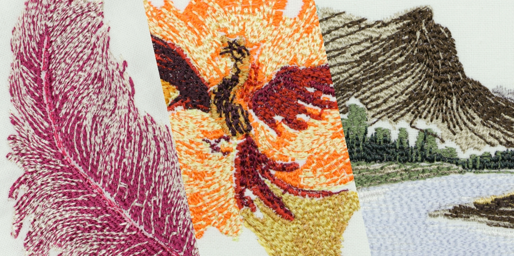
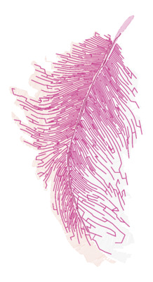
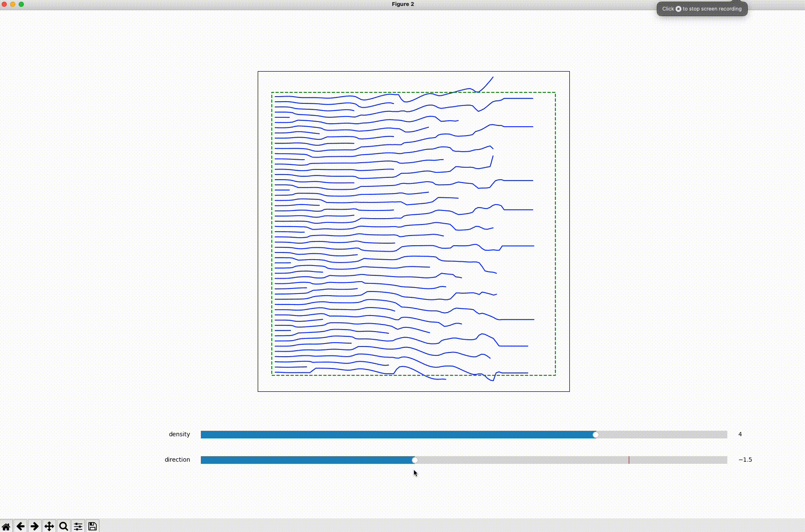

# Streamlines for Embroidery

Let the streamlines flow from your favorite photos to embroidery patterns you can sew on your hoodies using an automatic embroidery machine!

Learn more about it at our [project page](https://desmondlzy.me/publications/embroidery/).

_Directionality-Aware Design of Embroidery Patterns_. Computer Graphics Forum (Eurographics 2023); Liu Zhenyuan, Michal Piovarči, Christian Hafner, Raphaël Charrondière, Bernd Bickel

## Notice!

The code is a **research prototype**. It's not well-documented or optimized, and is nowhere near an end-user product.

The user interface for segmentation/color extraction which prepares the data for our algorithm on a user-provided image is not included.
Though, you can use the data in the repo to reproduce our examples as described in the following sections.

I'll be happy to help you with the problems you have: start an [issue](https://github.com/desmondlzy/embroidery-streamlines/issues) if you have questions, drop [me](mailto:desmondzyliu@gmail.com) an email if no response for too long...

## Environment Setup

The code is tested on Windows and macOS (M1).
Installation in a virtual environment via `conda` is recommended. The package list is provided at `environment.yml` or `environment-arm64.yml` for macOS or other arm64 systems.

```
conda env create -f environment.yml
```

If you are on macOS, 

```
conda env create -f environment-arm64.yml
```

Reason: on macOS, `pip install triangle` or `pip install triangle==20220202` won't install you the correct version because the wheel for macOS appears not indexed by PyPi. 
A workaround is to pip [install the specific version from github repo](https://stackoverflow.com/questions/13685920/install-specific-git-commit-with-pip). 
I'm only able to compile `git+https://github.com/drufat/triangle.git@v20220202` with python version up to 3.10 though.

<!-- ```bash
# On Apple Silicon machines, do this 
pip uninstall triangle
pip install git+https://github.com/drufat/triangle.git@v20220202
``` -->

## Run the scripts

A few interactive python scripts reside in the `examples` folder. You can run them from command line or [interactively in vscode](https://code.visualstudio.com/docs/python/jupyter-support-py) or other IDEs, or export them to jupyter notebooks.

### `examples/run_multiple_patches.py` 
Run the pipeline on the density and direction fields extracted from each segment of an image. Generate a preview of the embroidery pattern, and `.emb` files that can be used on the Bernina B590 machine. 



### `examples/run_interactive_regularization.py`
Demo of the interactive regularization. An example of a horizontal direction field and a linearly increasing density field is used here. A pyplot popup will appear for the interactive demo.



### `examples/run_analytical_field.py`
Run the pipeline on some analytical fields, please check the source code to choose from the fields available, or define your own fields.

## Test with your own images

This can be done via the script `examples/run_multiple_patches.py`. 
The script parses a json containing annotations for segments and directions and feeds it into our algorithm. You might wanna start looking at `examples/data/feather.json` for an example. 
There're three parts of information -- 1) boundary of each region for which you wanna generate an embroidery pattern (labeled `region-x` in the json file), 2) the user prescribed directions for each region (labeled `direction-x` for `region-x`), and 3) the image file which is used to extract density fields. 

We generated this json using an annotation tool called [Labelme](https://github.com/wkentaro/labelme). 
You need to follow the said naming conventions for labels of the regions/direction annotations in Labelme to generate a json parsable by our scripts. 


## Cite Us, and Reach Out!

Knowing our work being helpful to others means a lot to us! It will make my day to know how our work creates some value for you! Drop me a [note](mailto:desmondzyliu@gmail.com) anytime.

Please consider citing us if you use our project.

```
@article{zhenyuan2023embroidery,
  journal = {Computer Graphics Forum},
  title = {Directionality-Aware Design of Embroidery Patterns},
  author = {Zhenyuan, Liu and Piovar\u{c}i, Michal and Hafner, Christian and Charrondi\`{e}re, Rapha\"{e}l and Bickel, Bernd},
  doi = {10.1111/cgf.14770},
  year = {2023},
  volume = {42},
  number = {2},
  publisher = {The Eurographics Association and John Wiley & Sons Ltd.},
}
```

## Licensing

The project is licensed under MPL2.0, license infomation can be found at the beginning of each source file, and [here](./LICENSE).
