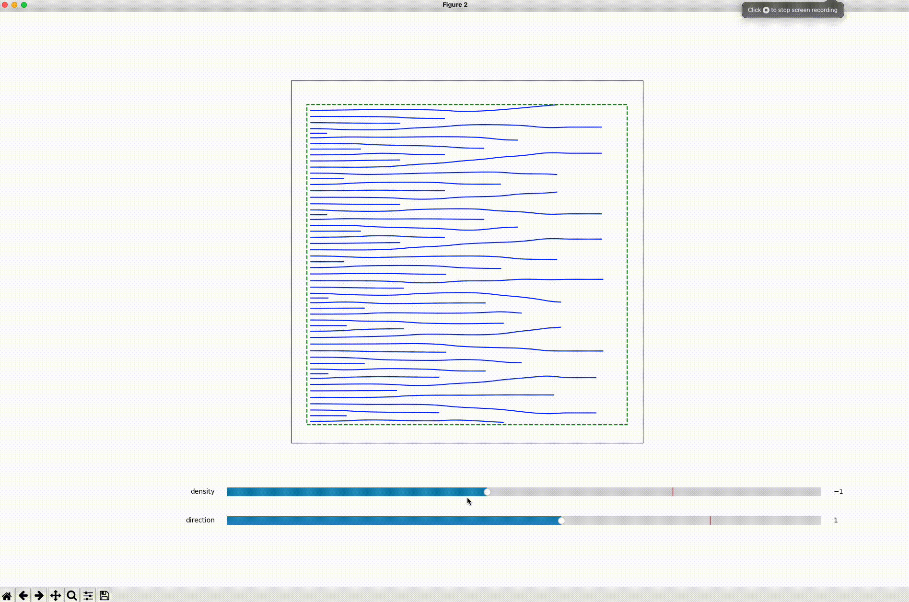

# Streamlines for Embroidery

Let the streamlines flow from your favorite photos to embroidery patterns you can sew on your hoodies using an automatic embroidery machine!

Learn more about it at our [project page](https://desmondlzy.me/publications/embroidery/).

_Directionality-Aware Design of Embroidery Patterns_. Computer Graphics Forum (Eurographics 2023); Liu Zhenyuan, Michal Piovarči, Christian Hafner, Raphaël Charrondière, Bernd Bickel

## Notice!

The code is a **research prototype**. It's not well-documented or optimized, and is nowhere near an end-user product.

The user interface for segmentation/color extraction which prepare the data for our algorithm on an user-provided image is not included.
However, you can use the data in the repo to reproduce our examples as described in the following sections.

Please drop [me](https://desmondlzy.me/) a note or start an [issue](https://github.com/desmondlzy/embroidery-streamlines/issues) if you have questions.

## Environment Setup

The code is tested on Windows and MacOS (M1).
Installation in a virtual environment via `conda` is recommended. The package list is provided at `environment.yml`
```
conda env create -f environment.yml
```


## Run the scripts

A few interactive python scripts reside in the `examples` folder. You can run them from command line or interactively in [vscode](https://code.visualstudio.com/docs/python/jupyter-support-py) or other IDEs, or export them to jupyter notebooks.

### `examples/run_multiple_patches.py` 
Run the pipeline on the density and direction fields extracted from each segment of an image. Generate a preview of the embroidery pattern, and `.emb` files that can be used on the Bernina B590 machine. 


### `examples/run_interactive_regularization.py`
Demo of the interactive regularization. An example of a horizontal direction field and a linearly increasing density field is used here. A pyplot popup will appear for the interactive demo.



### `examples/run_analytical_field.py`
Run the pipeline on some analytical fields, please check the source code to choose from the fields available, or define your own fields.


## Cite Us!

Please consider citing us if you find our work helpful for your project.

```
@article{zhenyuan2023embroidery,
  journal = {Computer Graphics Forum},
  title = {Directionality-Aware Design of Embroidery Patterns},
  author = {Zhenyuan, Liu and Piovar\u{c}i, Michal and Hafner, Christian and Charrondi\`{e}re, Rapha\"{e}l and Bickel, Bernd},
  doi = {10.1111/cgf.14770},
  year = {2023},
  volume = {42},
  number = {2},
  publisher = {The Eurographics Association and John Wiley & Sons Ltd.},
}
```

## Licensing

The project is licensed under MPL2.0, license infomation can be found at the beginning of each source file, and [here](./LICENSE).
